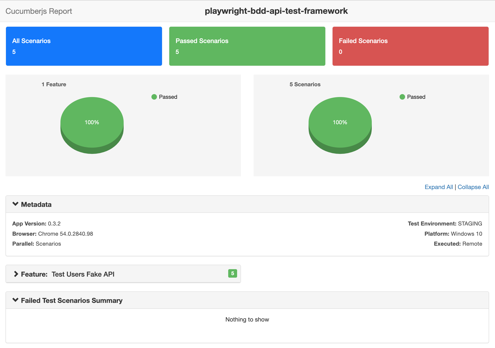

# API Test framework (Cucumber + Plawright)

### How to run the testsuite?

* Refer the `.nvmrc` to know the version
* Refer the `.npmrc` to set the npm registry
* install node dependencies using `npm install` command
* execute the command `npm test:dev` to run the testsuite in local
* execute the command `npm test:sit & npm test:qa` to run the testsuite of other environments
* if the npm package manager unavailable, yarn can be used with the same commands

###Features
* HTML test report generated which helps users to read information easily, it also helps to understand the time consumed between the steps
* Uses all latest node version & npm modules
* dev.json, sit.json, qa.json used to adjust each environment, headless mode and screen settings.
* info & error logs added into a file for the user reference

#### Cucumber Default timeout
* Cucumber default time out setting not working, when it is called from the hooks.
* Refer the issue here: https://github.com/cucumber/cucumber-js/issues/1610

